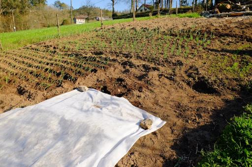
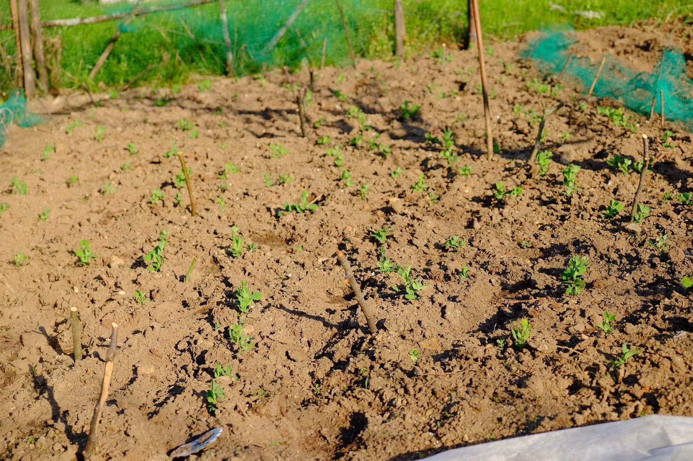
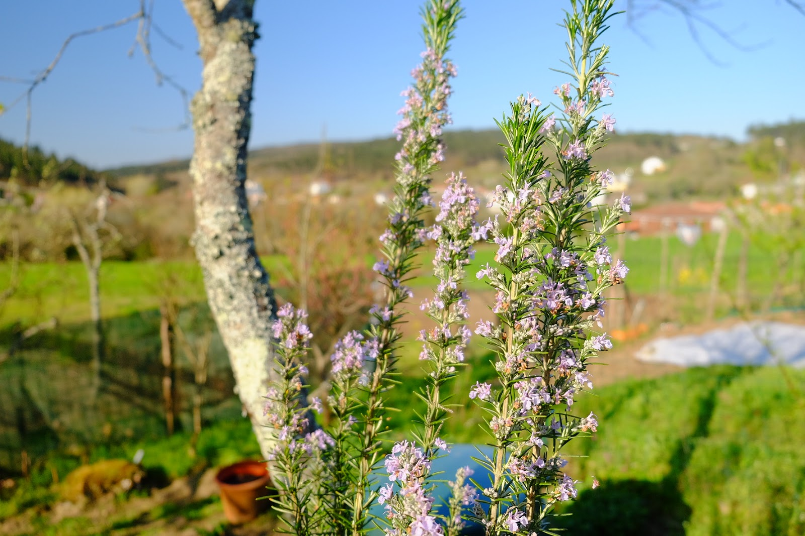
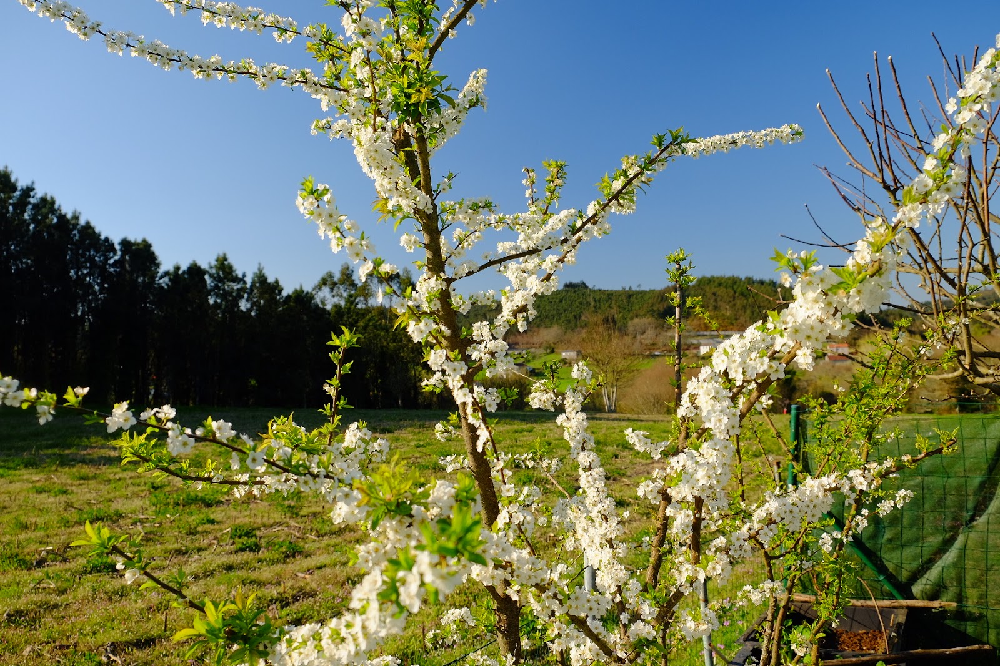
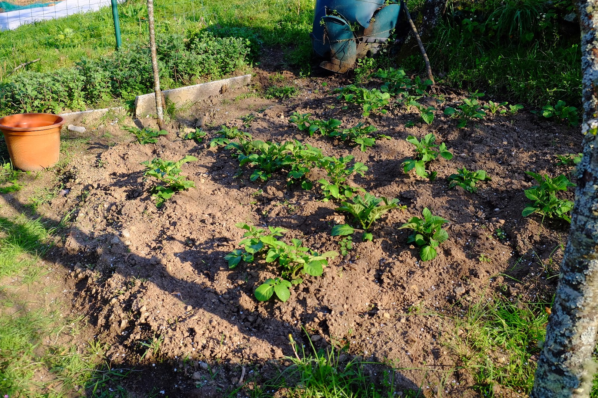
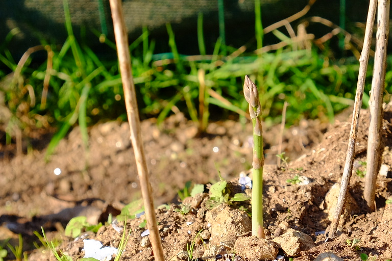
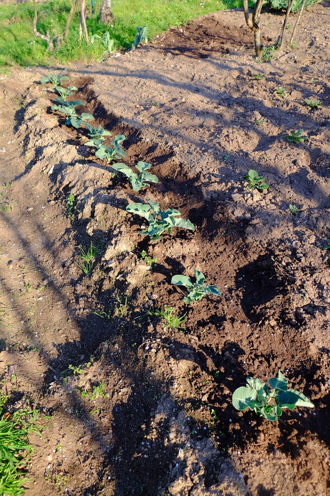

## Ola!

  
**traio unhas fotos da horta que xa vai collendo xeito.**
  
Preme na imaxe para vela nun tamaño maior.
  

### Ceboletas, allos e cenorias

  

  
As ceboletas, no plano medio, están moi bonitas e o **cebolo** que
plantamos tamén (abaixo), pero só fará uns dez días que o plantamos. Os
**allos**, na parte superior da imaxe, tamén están moi ben.  
  
Vense uns amorodos que trouxemos para renovar as plantas, algún tapados
pola manta térmica que lla puxemos principalmente para que os paxaros
non levantasen os chícharos.  
  
A dereita arriba vense a cenorias, que tamén naceron ben.  
  

### Chícharos

  

  
Os chícharos (*guisantes*) de este eito naceron ben e non os levantaron
os paxaros porque os tapamos coa rede fina.  
  

### Romeu

  

  
unha foto do **romeu** que está todo florido, e xa as **abellas**
traballan nel.  
  

### Pexegueiros

  
  

  
As árbores de froita de pedra tiveron estas semanas de bo tempo para ter
unha boa floración e polinización. Este ano, se non hai froita de pedra,
non será porque lle veu mal tempo nestas fechas.  
  
  

### Patacas

  

  
un dos múltiples eitos de patacas do cedo. Puxemos en catro sitios
distintos en diferentes datas e tipos de pataca para cedo. Estas naceron
todas moi ben (e outras), pero algunhas non. Con esto xa se conta.  
  

### Espárragos

  

  
Xa comemos un par de mancheas deles.  
  

### Brócoli

  
  

  
Un rego de brócoli. Por agora está moi san e con bo aspecto.
