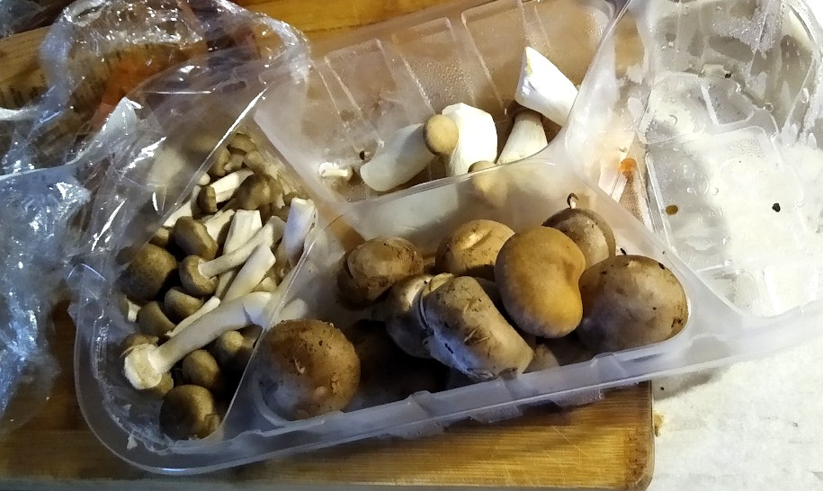
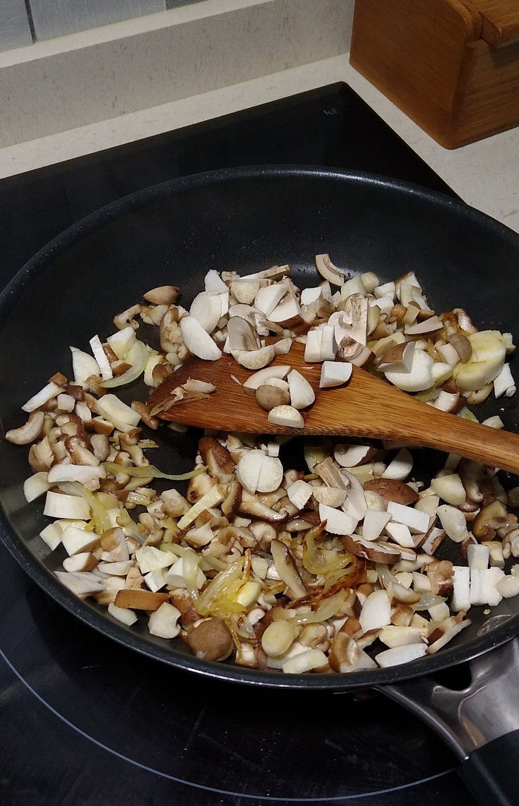
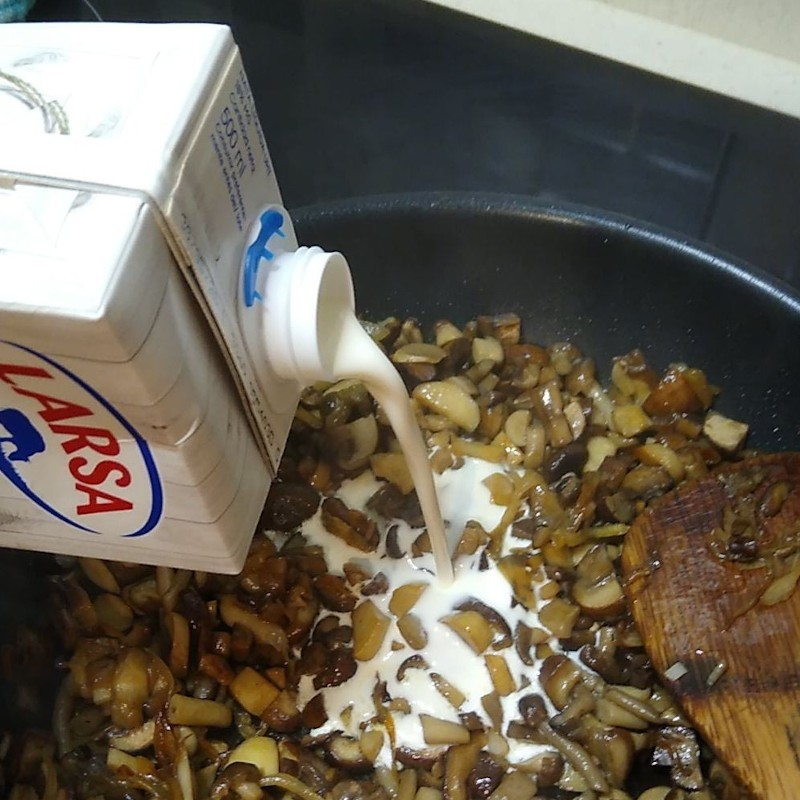
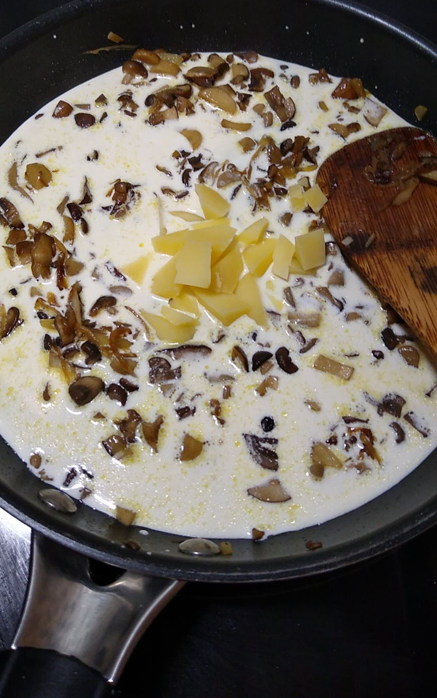
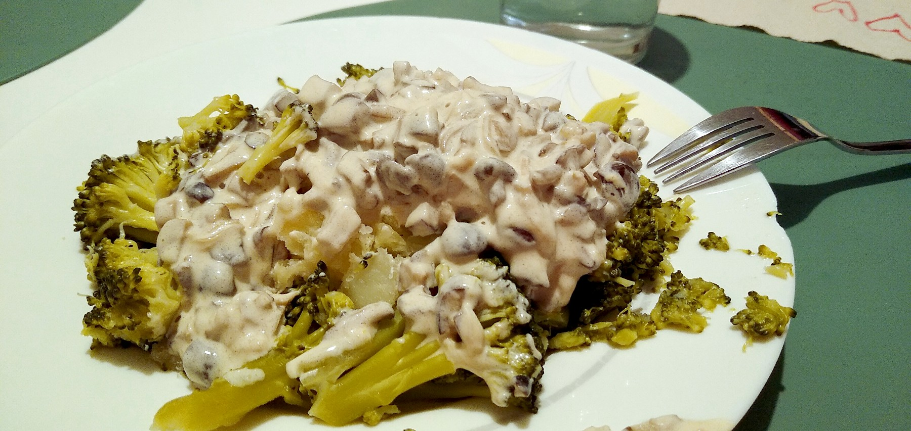

receita dunha gornición a base de cogomelos que acompaña ao brócoli (que
boa falta lle fai 😅)

## Ingredientes

-   cogomelos variados, ou dos que teñas a man/de oferta (un plato bo
    deles picados)
-   tona do leite (brick de 200ml)
-   queixo ([tetilla](http://queixotetilla.org/gl/), sansimón,
    semicurado, o galmesano ese...)
-   cebola
-   aceite de oliva
-   brócoli

## Preparación

Están a venda surtidos de cogomelos variados, pero podes mercar un só
tipo que a ti máis che guste (champiñons,
[pleuroto](https://gl.wikipedia.org/wiki/Pleuroto),
[shiitake](https://gl.wikipedia.org/wiki/Shiitake), ....)

*cogomelos, ao teu gusto*

*surtido de cogomelos*, este tipo de bandexas son moi xeitosas para
comer varios distintos sen deixar unha fortuna en cogomelos *"raros"*,
que en xeral tampouco son moi bós de atopar, en fresco.

Póchalas, xunto cunha pouquiña cebola en xuliana fina, picadas ou non
según o teu parecer, nun pouco de aceite de oliva, a lume moderado.
Dalle voltas, que non se queimen. Prefiro non darlle allo, porque o
sabor é bastante intenso xa co queixo e máis o propio efecto da tona (a
graxa dilúe os aromas dos cogomelos e aprécialos máis intensamente),
pero se usas champiñón simplesmente, ou unha variedade pouco aromática,
pódesllo botar.

*salteado*

Cando xa van estando, brandiñas, tenras (como que xa estarían listas
para comer, ou case case) engadimos a tona (simmm!!).

*tona e queixo*

Que levante fervedura (seguimos co lume medio, e agora xa o baixamos un
pouco máis, na miña inducción, ao 3-4) e botamos o queixo en anaquiños
ou relado, para que se vaia derretendo.

*imos engadindo e remexendo*

Se o queixo é forte de salgado, ten coidado co sal. Aquí vai un [San
Simón da Costa](https://www.sansimondacosta.com), punto afumado fetén.

*finalmente, o queixo*

Remexer a lume baixo ata que funde o queixo e acabe de coller
consistencia de crema... a consistencia dunha bechamel lixeira, case
velouté máis ben. Se o deixas moito, ou te pasas co queixo, espesa de
máis, fai grumos e xa non me parece tan apetitosa.

### e remexemos amodiño

Non hai que deixar que espese demasiado e faga grumos

## Brócoli

Mentras se foi preparando isto, cocemos o brócoli ao gusto, simplemente
en auga. Escurrímolo.

Cando a consistencia do preparado está fluída pero consistente, servimos
o brócoli e engadímoslle o preparado.

Neste caso utilizamos brócoli, pero serve como acompañamento para outros
alimentos como uns filetes á prancha, de peixe branco ou porco, uns ovos
fritidos, ... you name it.

## Resultado

*A comer!*

------------------------------------------------------------------------

orixinal de
[@drupas](https://red.confederac.io/@drupas "drupas")

